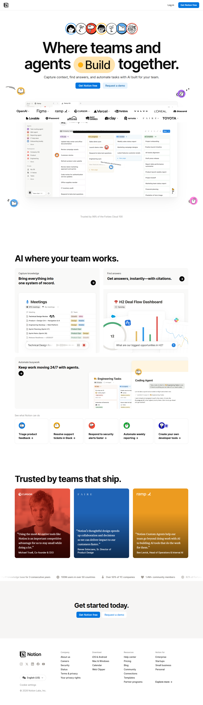
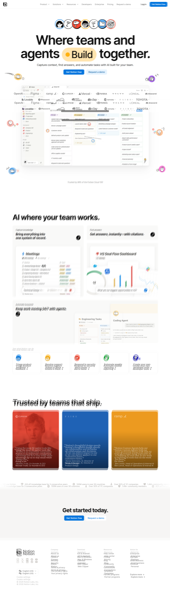
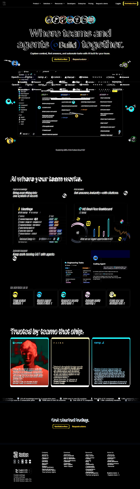

# Notion Homepage Clone

<p align="center">
  <strong>A source-backed, pixel-focused recreation of the Notion homepage.</strong>
</p>

<p align="center">
  <a href="https://notion-clone-devtechedge1.vercel.app/">Live demo →</a>
</p>

<p align="center">
  <a href="https://nextjs.org/"></a>
  <a href="https://notion-clone-devtechedge1.vercel.app/"></a>
  <a href="https://github.com/devtechedge/notion-clone/actions/workflows/ci.yml"></a>
  <a href="./LICENSE"></a>
  <a href="https://nodejs.org/"></a>
  <a href="https://react.dev/"></a>
  <a href="https://www.typescriptlang.org/"></a>
  <a href="https://github.com/devtechedge/notion-clone/stargazers"></a>
  <a href="https://github.com/devtechedge/notion-clone/network/members"></a>
  <a href="https://github.com/devtechedge/notion-clone/commits/main"></a>
  <a href="./LICENSE"></a>
  
</p>

<p align="center">
  
</p>

<p align="center">
  <a href="#overview">Overview</a> ·
  <a href="#getting-started">Getting started</a> ·
  <a href="#visual-qa">Visual QA</a> ·
  <a href="#roadmap">Roadmap</a>
</p>

## Overview

This repository is a high-fidelity recreation of the supplied Notion homepage
reference. It exists as a visual engineering exercise: the goal is to preserve
the original page’s coordinates, typography, artwork, spacing, and responsive
behavior rather than reinterpret the design.

The supplied `reference.html` is treated as the visual source of truth. Its
captured DOM, CSS, inline artwork, SVGs, fonts, and design tokens are retained
so the result stays source-backed and reproducible.

## Key Features

| Area | What is included |
| --- | --- |
| Hero | Headline, Build pill, avatar rail, artwork, floating illustrations, and CTAs |
| Navigation | Desktop navigation, product links, login, and primary action |
| Logo wall | Trusted-by statement and company logo arrangement |
| Bento cards | Source artwork for meetings, dashboards, agents, and quick links |
| Testimonials | Gradient quote cards, attribution, and statistics strip |
| CTA | Get-started section with matching actions and spacing |
| Footer | Brand block, language selector, resource columns, and legal details |
| Responsive layout | Reference-driven behavior across viewport sizes |
| Source-backed rendering | Supplied DOM and inline assets preserved instead of redrawn |
| Deterministic image loading | Native eager loading and synchronous decoding for Bento artwork |
| Pixel verification | Full-page captures, overlays, and difference images |
| Visual QA | Chromium checks at a controlled desktop viewport |

## Technology Stack

| Layer | Choice |
| --- | --- |
| Framework | Next.js 14 App Router |
| UI runtime | React 18 |
| Language | TypeScript |
| Styling | Captured reference CSS with CSS variables and design tokens |
| Tooling | npm, TypeScript compiler, Next.js build pipeline |
| Rendering | Static App Router shell redirecting to the reference document |
| Assets | Supplied inline WebP, SVG, font, and HTML assets |
| Verification | Chromium screenshots and source-level image inspection |

See [the architecture notes](./docs/architecture.md) for the rendering
pipeline and image lifecycle decisions.

## Repository Structure

```text
.
├── .github/
│   ├── ISSUE_TEMPLATE/
│   ├── workflows/ci.yml
│   └── PULL_REQUEST_TEMPLATE.md
├── app/
│   ├── layout.tsx       # App Router metadata and document shell
│   └── page.tsx         # Root redirect to the source-backed homepage
├── docs/
│   ├── screenshots/     # Committed reference and visual QA captures
│   └── visual-qa.md     # Rendering and parity notes
├── public/
│   ├── favicon.ico
│   └── reference.html   # Supplied single-file homepage capture
├── .editorconfig
├── CHANGELOG.md
├── CODE_OF_CONDUCT.md
├── CONTRIBUTING.md
├── LICENSE
├── README.md
├── SECURITY.md
├── next-env.d.ts
├── package-lock.json
├── package.json
└── tsconfig.json
```

The reference page is intentionally kept as a single source-backed document.
The thin Next.js shell provides a conventional project entrypoint without
rebuilding the captured page into visually divergent components.

## Getting Started

### Prerequisites

- Node.js 18.17 or newer
- npm 9 or newer
- Chromium for visual QA

### Installation

```bash
git clone https://github.com/devtechedge/notion-clone.git
cd notion-clone
npm install
```

### Development

```bash
npm run dev
```

Open [http://localhost:3000](http://localhost:3000).

### Build

```bash
npm run build
```

### Production

```bash
npm run build
npm run start
```

## Visual QA

Visual parity is evaluated against the supplied reference screenshot and saved
HTML. The workflow uses:

1. A controlled Chromium viewport.
2. Full-page screenshots of the reference and localhost pages.
3. A blended overlay to reveal alignment drift.
4. A pixel-difference image to locate high-contrast mismatches.
5. Browser inspection of image source, dimensions, visibility, and paint state.

| Artifact | Purpose |
| --- | --- |
| [Reference](./docs/screenshots/desktop-reference.png) | Supplied visual baseline |
| [Local desktop](./docs/screenshots/desktop-local.png) | Current localhost render |
| [Overlay](./docs/screenshots/visual-qa-overlay.png) | Blended alignment comparison |
| [Pixel difference](./docs/screenshots/pixel-difference.png) | Amplified visual delta |

## Rendering Decisions

### Why the supplied HTML is used

The reference document contains the exact DOM hierarchy, CSS, font declarations,
inline assets, and design-token values needed for fidelity. Recreating those
details manually would introduce unnecessary visual drift.

### Image lifecycle handling

The saved document uses lazy and asynchronous image behavior. That lifecycle
can leave below-the-fold Bento artwork unpainted during an immediate full-page
capture even though the data URI and natural dimensions are valid.

The eight Bento images therefore use native eager loading and synchronous
decoding. This is a browser rendering decision, not a screenshot-time script:
there is no artificial scrolling, timeout-based painting, or placeholder art.

### Artwork preservation

Existing WebP, SVG, canvas-like compositions, logos, and font assets remain
source-backed. Artwork is preserved rather than redrawn so the implementation
can be audited against the supplied reference.

## Project Goals

- High visual fidelity to the supplied reference.
- Pixel-accurate coordinates, typography, spacing, and composition.
- Deterministic rendering in Chromium.
- No placeholder or generically recreated artwork.
- A maintainable project shell around the source-backed page.

## Challenges Solved

<details>
<summary>Lazy loading</summary>

Below-the-fold images can remain unloaded during automated full-page capture.
The Bento assets are promoted to native eager loading while preserving their
original source data.
</details>

<details>
<summary>Image decoding</summary>

Asynchronous decoding can complete after layout and capture have already begun.
Synchronous decoding makes the critical Bento artwork available for the first
stable render.
</details>

<details>
<summary>Render lifecycle and viewport activation</summary>

The page must render correctly without synthetic scroll events or delayed
capture logic. The final approach moves the fix into standard image loading
semantics rather than manipulating viewport state.
</details>

<details>
<summary>Full-page capture</summary>

Reference and localhost captures are normalized to the same dimensions before
overlay and difference generation, making section-level drift easier to find.
</details>

## Performance

- Next.js provides a small App Router shell and production build pipeline.
- Inline source assets avoid network dependency for the captured page.
- Bento images use deterministic native loading instead of runtime polling.
- `npm run build` performs compilation, type checking, and static generation.
- Visual fidelity is prioritized before secondary Lighthouse tuning.

## Roadmap

- [x] Preserve the supplied HTML and inline artwork.
- [x] Add native deterministic Bento image loading.
- [x] Add Chromium visual QA captures and comparison artifacts.
- [x] Add repository documentation and contribution policy.
- [x] Add GitHub Actions build validation.
- [ ] Add Playwright-based screenshot regression automation.
- [ ] Run visual regression checks on every pull request.
- [ ] Add Lighthouse reporting to CI.
- [ ] Add a responsive viewport comparison matrix.

## Repository Statistics

| Property | Value |
| --- | --- |
| Languages | TypeScript, CSS, HTML, inline SVG/WebP |
| Framework | Next.js App Router |
| Architecture | Static source-backed reference document with a Next.js shell |
| Project type | Frontend visual recreation / portfolio case study |
| License | MIT |

## Screenshots

### Desktop



### Reference


### Visual QA Overlay



### Pixel Difference



The gallery intentionally keeps the reference, local render, overlay, and
difference captures together so visual review can be repeated from a clean
clone.

## Acknowledgements

Thanks to the supplied visual reference, saved HTML capture, design tokens, and
network asset archive that make source-backed parity work possible.

## License

Distributed under the MIT License. See [LICENSE](./LICENSE).

## Author

Built by [Devtechedge](https://github.com/devtechedge).

Repository: [github.com/devtechedge/notion-clone](https://github.com/devtechedge/notion-clone)
